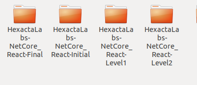

[Volver](../README.md)

## General
En las guías se promueve el uso de __VSCode__ como herramienta de desarrollo.  
Cada vez que avancen en las etapas, tendrán que descargar una nueva base de código. 

1. Instalar Visual Studio Code [Link](https://code.visualstudio.com/)
1. Crear una carpeta __HxLabs__ y abrir Visual Studio Code en la misma
1. Clonar el proyecto de GitHub en Visual Studio Code
	1. CTRL + SHIFT + P y escribir "git clone"
	1. Agregar la URL del proyecto y seleccionar una carpeta.
	1. Se puede clonar directamente en la carpeta haciendo *git clone "url"* desde una linea de comandos
    1. Repetir estos pasos para cada proyecto.
1. Luego, cuando comience la *etapa X* ir a la carpeta correspondiente y abrir una nueva instancia de VSCode, o directamente desde Code, *File/Open Folder*.

Debería quedar algo semejante a esto: 

## Frontend

1. [Prerequisitos](./prerequisitos.md)
2. [Introducción a React](./react.md)
3. [Introducción a Redux](./redux.md)
4. [Estructura de Carpetas](./estructura-carpetas.md)

## Backend

1. [Prerequisitos](./prerequisitosnetcore.md)
2. [Introducción a NetCore](./netcore.md)
3. [Estructura de Carpetas](./estructura-carpetas-netcore.md)
4. [Troubleshooting](./troubleshooting.md)