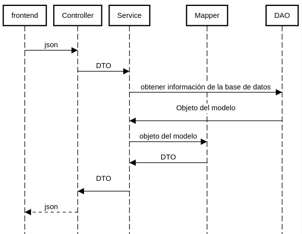

[Volver](./index.md)

# NET Core

## Introducción

[NET Core](https://docs.microsoft.com/es-es/dotnet/core/) es un Framework de código abierto creado por Microsoft, que nos proporciona herramientas para el desarrollo de aplicaciones multiplataforma .lo que significa que podemos desarrollar y ejecutar una aplicación en varios sistemas operativos, como Linux, Windows, iOS. Se pueden desarrollar en .Net Core: aplicaciones de escritorio, aplicaciones web, aplicaciones móviles, juegos, inteligencia artificial, etc.

[ASP.NET Core](https://docs.microsoft.com/es-es/aspnet/core/?view=aspnetcore-3.1) es un marco de trabajo para desarrollar aplicaciones web multiplataforma compilado con .Net Core.


### ¿Qué es una API?

Una API (Application Programming Interface) es la interfaz que un software utiliza para interactuar con otro software.

Un Web API es un API que se invoca a través del protocolo HTTP.  Se detalla solamente la forma en que cada rutina debe ser llevada a cabo y la funcionalidad que brinda, sin otorgar información acerca de cómo se lleva a cabo la tarea. La ventaja de usar HTTP es que es posible hacer peticiones desde cualquier lenguaje de programación, lo que hace a la Web un medio ideal para conectar aplicaciones. Para gestionar las solicitudes, una API web usa Controllers.

Netcore posee un framework de trabajo para desarrollar las APIs. [Link](https://docs.microsoft.com/en-us/aspnet/core/tutorials/first-web-api?view=aspnetcore-3.1&tabs=visual-studio)

### Inyección de Dependencias
Es una técnica en la que un objeto suministra las dependencias de otro. Está tecnica nos permite evitar la creación de objetos de servicio, para lograr legibilidad y reuso de código.

Cualquier aplicación no trivial está formada por dos o más clases que colaboran entre sí para realizar alguna lógica. Tradicionalmente cada objeto se hacía cargo de obtener sus propias referencias a los objetos a los cuales colaboraba (sus dependencias). Esto lleva a código acoplado y difícil de probar.

Cuando se aplica inyección de dependencia le decimos a una entidad externa que provea las dependencias a los objetos. Esto nos resuelve el problema del acoplamiento.

El acoplamiento es un mal necesario ya que sin él los objetos no podrían interactuar para resolver problemas, pero cuan menor sea el acoplamiento es más reutilizable, comprobable y flexible.

La ventaja clave de inyección de dependencia es el acoplamiento débil. Si un objeto solo conoce sus dependencias mediante su interfaz (no su implementación o como fueron definidos) entonces la dependencia puede intercambiarse con una implementación diferente sin que el objeto dependiente sepa la diferencia.

La inyección de dependencias es una de las maneras de implementar [Inversión de Control o IoC](https://en.wikipedia.org/wiki/Inversion_of_control).

Netcore posee soporte nativo para Inyección de Dependencias, el cual es utilizado en este proyecto. [Link](https://docs.microsoft.com/en-us/aspnet/core/fundamentals/dependency-injection?view=aspnetcore-3.1)

Para injectar objetos, debemos utilizar los constructores de la clase. En los constructores indicamos que debe injectar el contenedor de .net, por ejemplo : 

```C#
   public class ProductTypeService: BaseService<ProductType>
    {                
        public ProductTypeService(IRepository<ProductType> repository)
            : base(repository)
        {
        }
    }
```
En el ejemplo se puede ver que se esta inyectando un IRepository<ProductType> al servicio ProductTypeService y el contenedor puede saber que inyectar, dado que busca en la clase Startup que instancia debe injectar según el tipo. Esto se inica con esta linea :

```C#
services.AddTransient<IRepository<ProductType>, BaseRepository<ProductType>>();
```
En la clase Startup. 

### Startup
La clase Startup esta contenida en el archivo Startup.cs en la carpeta raíz del proyecto.

Las aplicaciones ASP.NET Core debe incluir esta clase. Como su nombre indica, se ejecuta primero cuando se inicia la aplicación. Y tiene como objetivo brindar un conjunto de configuraciones para que nuestra aplicación pueda funcionar. 

El método ConfigureServices es un lugar donde se registran las clases dependientes en el contenedor IoC o injección de dependencia. Después de registrar la clase dependiente, se puede usar en cualquier lugar de la aplicación. Solo necesita incluirlo en el parámetro del constructor de una clase donde desea usarlo y el contenedor de IoC lo inyectará automáticamente.

El método Configure es un lugar donde puede configurar la canalización de solicitudes de aplicaciones para su aplicación utilizando la instancia IApplicationBuilder que proporciona el contenedor IoC.

## Tipos de Clases
Se detallan las clases generales que se encuentran en el backend.

### Controller

- Un controller maneja requests HTTP a una ruta determinada y devuelve responses al llamador. 
Microsoft.AspNetCore.Mvc proporciona atributos que se pueden usar para configurar el comportamiento de los controladores API web y los métodos de acción, como por ejemplo especificar el verbo de acción HTTP admitido y cualquier código de estado HTTP conocido que se pueda devolver. Contiene lógica de la aplicación y pasa la información del usuario al servicio.

### Service

- Es un middleware entre el controller y el repositorio. Toma data del controller, hace validaciones y lógica de negocio y llama al repositorio para que manipule la información.

### Repository
- Capa de interaccion con el modelo que performa operaciones con la base de datos. Es el componente que encapsula la lógica para acceder a la base de datos. 
[Link](https://docs.microsoft.com/en-us/dotnet/architecture/microservices/microservice-ddd-cqrs-patterns/infrastructure-persistence-layer-design)


### Model
- Es la representación de la información de negocio con la cual el sistema opera.
- Es un objeto del dominio que encapsula comportamiento y datos. Cuando encapsula poco comportamiento recibe el nombre de "modelo anémico". 
[Domain Model](https://martinfowler.com/eaaCatalog/domainModel.html)  
[Anemic Domain Model](https://martinfowler.com/bliki/AnemicDomainModel.html)

### DTO

- "Data transfer object" por sus siglas en inglés, es un objeto simple que transporta datos. Por ejemplo, puede ser utilizado cuando hay una transferencia del cliente al servidor o viceversa. Se utiliza para reducir el número de llamadas a la hora de retornar objetos del modelo, es decir son objetos que no poseen comportamientos y los mismos pueden agrupar varios modelos.
[DTO](https://martinfowler.com/eaaCatalog/dataTransferObject.html)

### Mapper
- Es utilizado para mapear un modelo de negocio a un DTO o viceversa.
- Realizar el mapping suele ser tedioso ya que lo que suele ocurrir son situaciones repetitivas:	
    - Mapear fields que tienen los mismos nombres	
    - Mapear fields de elementos anidados => DTO: CustomerName <=> Entity: Customer { Name }	
En esas situaciones (y otras) [AutoMapper](https://docs.automapper.org/en/stable/Getting-started.html) es una herramienta sencilla para utilizar. 

### Swagger	 
Es un lenguaje que nos permite describir y especificar nuestras APIs.	
Esto permite a las máquinas y humanos entender como funcionan nuestros servicios Rest, minimizando el tiempo de integración de los mismos y dejando una documentación inline en el código.	
Swagger UI es una herramienta que lee esta información y genera un frontend que nos permite probar el funcionamiento del backend.	


## Interacción 

Cuando desde frontend realizan un pedido al backend, este es atendido por un controller determinado. El controller que atiende este pedido es determinado por la URL donde se hace el pedido. Dicho Controller utiliza un service para resolver los pedidos. El service utiliza un DAO para acceder a la base de datos, un mapper para transformar un objeto del modelo a DTO y siempre retorna un DTO. Dicha interacción se puede ver en este diagrama de secuencia: 


<!--- ir a https://sequencediagram.org/ y pegar el codigo : 
participant frontend
participant Controller
participant Service
participant Mapper
participant DAO

frontend->Controller:json
Controller->Service:DTO
Service->DAO:obtener información de la base de datos
Service<-DAO:Objeto del modelo\n
Service->Mapper:objeto del modelo
Service<-Mapper:DTO
Controller<-Service:DTO\n
frontend<--Controller:json
--->


### Notas
La [Estructura de Carpetas](./estructura-carpetas-netcore.md) sigue la lógica de separar los elementos antes mencionados.
Normalmente este esquema recibe el nombre de [N-Layer](https://es.wikipedia.org/wiki/Programaci%C3%B3n_por_capas)

## Referencias
[Documentación Oficial Net Core](https://docs.microsoft.com/es-es/dotnet/core/)   
[Documentación Oficial Web API](https://docs.microsoft.com/en-us/aspnet/web-api/)   
[Documentación Oficial MVC](https://docs.microsoft.com/en-us/aspnet/mvc/)  
[Documentación dependeny injection](https://docs.microsoft.com/en-us/aspnet/core/fundamentals/dependency-injection)   
[Documentación AutoMapper](https://docs.automapper.org/en/stable/Getting-started.html)   
[Documentación Swagger](https://github.com/domaindrivendev/Swashbuckle.AspNetCore)   
[Ejemplo Swagger Microsoft](https://docs.microsoft.com/en-us/aspnet/core/tutorials/web-api-help-pages-using-swagger?view=aspnetcore-3.1)   